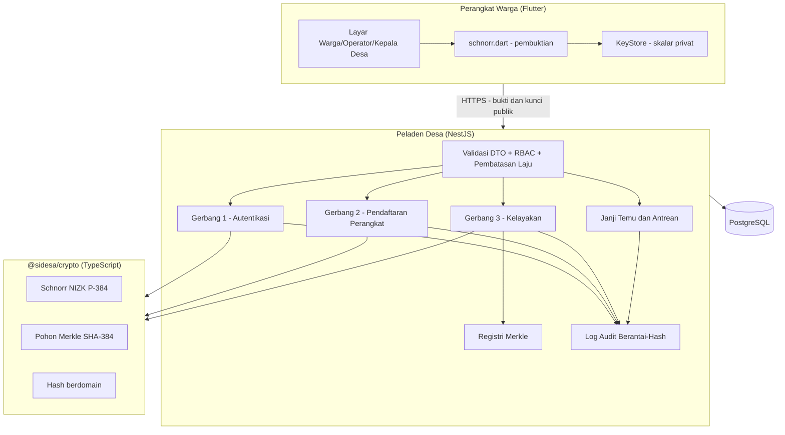
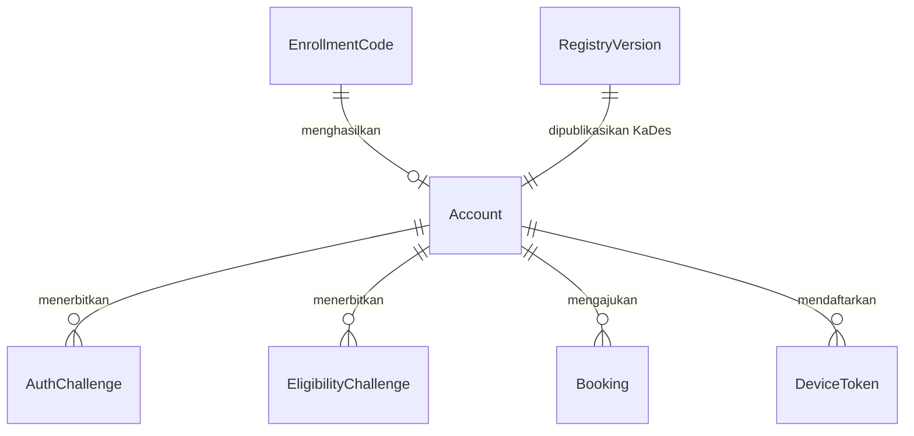

# Dokumen Arsitektur — SIDESA-CM

**Sistem Digital Layanan Desa Cibeteung Muara**
Kecamatan Ciseeng, Kabupaten Bogor · Program ABDIMAS Politeknik Siber dan Sandi Negara (D4 Rekayasa Kriptografi)

| | |
|---|---|
| **Versi dokumen** | 1.0 |
| **Tanggal** | 29 Juli 2026 |
| **Keadaan kode yang dirujuk** | commit `9974e01` pada cabang `feat/booking-eligibility-gate` |
| **Status** | Tahap 1 selesai dan tergabung; Tahap 2a (gerbang kelayakan pindah ke janji temu) selesai |

---

## Daftar Isi

1. [Ringkasan Eksekutif](#1-ringkasan-eksekutif)
2. [Masalah yang Diselesaikan](#2-masalah-yang-diselesaikan)
3. [Prinsip Arsitektur](#3-prinsip-arsitektur)
4. [Peta Komponen](#4-peta-komponen)
5. [Model Identitas: Satu Primitif, Tiga Gerbang](#5-model-identitas-satu-primitif-tiga-gerbang)
6. [Lapisan Kriptografi](#6-lapisan-kriptografi)
7. [Registri Penduduk dan Pohon Merkle](#7-registri-penduduk-dan-pohon-merkle)
8. [Model Data](#8-model-data)
9. [Antarmuka Peladen](#9-antarmuka-peladen)
10. [Alur Utama](#10-alur-utama)
11. [Kendali Keamanan](#11-kendali-keamanan)
12. [Keputusan Arsitektur dan Konsekuensinya](#12-keputusan-arsitektur-dan-konsekuensinya)
13. [Status Implementasi](#13-status-implementasi)
14. [Batasan yang Diketahui](#14-batasan-yang-diketahui)
15. [Peta Jalan](#15-peta-jalan)

---

## 1. Ringkasan Eksekutif

SIDESA-CM adalah layanan janji temu dan antrean digital untuk Desa Cibeteung Muara. Warga memesan waktu bertemu Kepala Desa melalui aplikasi, dan sistem memverifikasi bahwa pemohon memang penduduk desa yang berhak — **tanpa pernah mengumpulkan atau mengirimkan Nomor Induk Kependudukan (NIK)**.

Seluruh lapisan identitas sistem bertumpu pada **satu primitif kriptografi**: bukti tanpa pengetahuan Schnorr (*non-interactive zero-knowledge proof of knowledge*) di atas kurva P-384 dengan tantangan berdomain SHA-384. Tiga gerbang identitas — autentikasi, pendaftaran perangkat, dan verifikasi kelayakan — membuktikan hal yang sama, yaitu penguasaan sebuah skalar privat, dan hanya dibedakan oleh konteks yang mengikat masing-masing bukti.

Sistem **tidak memiliki fitur tanda tangan dokumen digital**. Keputusan itu diambil pada Juli 2026 dan mengubah produk secara mendasar; rinciannya ada pada [Bagian 12](#12-keputusan-arsitektur-dan-konsekuensinya).

---

## 2. Masalah yang Diselesaikan

Warga yang perlu bertemu Kepala Desa datang langsung ke kantor desa tanpa kepastian giliran. Karena agenda Kepala Desa tidak selalu pasti, warga dapat menunggu berjam-jam atau pulang tanpa terlayani. Persoalan ini bersifat struktural, bukan sekadar ketidaknyamanan: yang hilang adalah **kepastian**.

Namun memindahkan antrean ke aplikasi memunculkan persoalan kedua. Layanan desa hanya boleh diberikan kepada penduduk desa, sehingga sistem harus dapat memastikan kelayakan pemohon. Cara lazim adalah meminta NIK — dan justru di situ letak bahayanya: sebuah basis data janji temu berubah menjadi basis data kependudukan, dengan seluruh kewajiban dan risiko yang menyertainya di bawah UU PDP No. 27/2022.

**Arsitektur ini menjawab keduanya sekaligus:** kepastian giliran diberikan oleh subsistem janji temu, sedangkan kelayakan dibuktikan secara kriptografis tanpa NIK pernah melintasi jaringan atau tersimpan di peladen.

### Sasaran privasi

Sasarannya dinyatakan tegas sebagai **"NIK privat, warga tetap terindentifikasi"**. Peladen mengetahui *akun mana* yang mengajukan janji temu — hal ini memang diperlukan agar petugas dapat memanggil nama saat giliran tiba. Yang tidak diketahui peladen adalah **data kependudukan di balik akun tersebut**. Ketakterhubungan antarpermohonan (*unlinkability*) secara sadar **bukan** sasaran; menuntutnya berarti membayar biaya konstruksi yang jauh lebih berat tanpa manfaat yang diperlukan model ancaman ini.

---

## 3. Prinsip Arsitektur

**P1 — Identitas adalah penguasaan kunci.** Autentikasi membuktikan penguasaan skalar privat, bukan pengetahuan atas suatu rahasia bersama. NIK bersifat semipublik dan tercetak pada kartu identitas, sehingga **tidak memenuhi syarat sebagai faktor autentikasi**. Tidak ada kata sandi di sistem ini.

**P2 — Satu primitif untuk seluruh gerbang identitas.** Ketiga gerbang memakai bukti Schnorr yang sama. Keseragaman ini mengurangi luas permukaan yang harus ditinjau, dan ditegakkan oleh pengujian penjaga otomatis.

**P3 — Minimalisasi data.** Yang tersimpan adalah `nikCommitment` (digest SHA-384), bukan NIK mentah. Batas masukan menolak NIK mentah secara eksplisit.

**P4 — Rahasia tidak pernah meninggalkan perangkat.** Skalar privat warga hanya ada di perangkatnya. Peladen menyimpan kunci publik dan memverifikasi bukti.

**P5 — Kegagalan harus berupa penolakan, bukan galat.** Masukan cacat ditolak secara seragam pada batas masukan setiap gerbang. Galat internal membocorkan jejak implementasi dan merupakan cacat tersendiri.

**P6 — Kriptografi hanya melalui `@sidesa/crypto`.** Tidak ada primitif yang digulung sendiri dan tidak ada pustaka kriptografi lain. Sisi Dart wajib cocok bit-per-bit dengan sisi TypeScript, ditegakkan oleh pengujian jawaban-diketahui lintas bahasa.

---

## 4. Peta Komponen



### Monorepo (npm workspaces)

| Paket | Isi | Uji |
|---|---|---|
| `packages/crypto` | `@sidesa/crypto` — Schnorr, Merkle, hash berdomain, bukti kelayakan | 34 |
| `packages/backend` | NestJS + Prisma + PostgreSQL — gerbang identitas, registri, janji temu, audit, notifikasi | 112 |
| `packages/app` | Flutter (Material 3) — UI seluruh peran, kripto Dart (`pointycastle`), klien API | 36 |

**Total 182 pengujian otomatis.** Pengujian ditulis lebih dahulu (TDD) dan tidak pernah dilemahkan untuk membuat rangkaian menjadi hijau.

---

## 5. Model Identitas: Satu Primitif, Tiga Gerbang

Ketiganya menjalankan protokol yang identik. Yang membedakan **hanya konteks** yang diikat ke dalam tantangan — dan justru pemisahan konteks itulah yang mencegah sebuah bukti dipindahkan dari satu gerbang ke gerbang lain.

| Gerbang | Konteks yang diikat | Yang dibuktikan |
|---|---|---|
| **1. Autentikasi** | `SIDESA-auth-v1 \| akun \| nonce` | Perangkat menguasai skalar di balik kunci publik terdaftar, terikat pada nonce sekali pakai dari peladen |
| **2. Pendaftaran perangkat** | `SIDESA-enroll-v1 \| kode \| kunciPublik` | Pengklaim benar-benar menguasai kunci yang sedang didaftarkan |
| **3. Kelayakan (janji temu)** | `SIDESA-booking-eligibility-v1 \| akun \| nonce` | Pemohon adalah anggota registri **dan** menguasai kunci yang dikomitmenkan daun Merkle-nya |
| *3b. Kelayakan (surat)* | `SIDESA-letter-eligibility-v1 \| akun \| jenis \| nonce` | Sama, untuk subsistem surat yang dihapus pada Tahap 2b |

> **Mengapa Gerbang 2 penting.** Kunci publik bersifat unik di basis data. Tanpa bukti penguasaan, seseorang yang mencuri kode pendaftaran dapat mendaftarkan kunci **milik orang lain**, sehingga pemilik sah kunci itu **terkunci permanen** dari sistem. Bukti penguasaan menutup jalur tersebut.

---

## 6. Lapisan Kriptografi

### Parameter

| Kegunaan | Primitif | Parameter |
|---|---|---|
| Bukti pengetahuan | Schnorr NIZK (Fiat–Shamir) | Kurva **P-384** |
| Fungsi hash | **SHA-384** | Digest 48 bita |
| Pohon Merkle | SHA-384 bertanda | Daun `0x00`, simpul `0x01` |

Kurva **P-256** dan **SHA-256 sebagai hash mandiri tidak digunakan di mana pun**.

### Hash berdomain

Seluruh pencernaan hash melalui `domainHash`, yang mengawali domain dan **setiap** bagian dengan panjangnya sebagai bilangan 32-bit *big-endian* sebelum dirangkai. Akibatnya perangkaian bersifat tak ambigu: tidak ada dua masukan berbeda yang menghasilkan untaian tercerna yang sama, sehingga nilai hash dari satu kegunaan tidak dapat dipindahkan ke kegunaan lain.

Domain yang dipakai:

| Domain | Kegunaan |
|---|---|
| `SIDESA-schnorr-v1` | Tantangan bukti Schnorr |
| `SIDESA-resident-leaf-v1` | Daun registri penduduk |
| `SIDESA-enroll-code-v1` | Hash kode pendaftaran (kode disimpan tercerna) |
| `SIDESA-audit-v1` | Rantai log audit |
| `SIDESA-audit-payload-v1` | Muatan entri audit |

### Protokol Schnorr

Diberikan skalar rahasia `x`, kunci publik `X = x·G`, dan konteks `c`:

**Pembuktian**
1. Ambil skalar acak kriptografis `k`, dengan `1 ≤ k < n`
2. Hitung `R = k·G` (bentuk terkompresi, 49 bita)
3. Hitung `e = H_d(SIDESA-schnorr-v1, X, R, c) mod n`; ulangi bila `e = 0`
4. Hitung `s = (k + e·x) mod n`; ulangi bila `s = 0`
5. Keluarkan `π = (R, s)`

**Verifikasi** — terima bila dan hanya bila `s·G = R + e·X`, dengan `e` dihitung ulang dari `X`, `R`, dan `c` yang sama. Titik di luar kurva, skalar di luar rentang sah, dan tantangan bernilai nol ditolak.

Karena `X` ikut dicerna ke dalam tantangan, sebuah bukti untuk kunci A **tidak dapat** diajukan sebagai bukti untuk kunci B.

### Format wire

| Bagian | Ukuran | Keterangan |
|---|---|---|
| `R` | 49 bita | Titik terkompresi P-384 |
| `s` | 48 bita | Skalar *big-endian* |
| **Total** | **97 bita** | Heksadesimal huruf kecil sepanjang **194 karakter** |

Kunci publik terkompresi: 49 bita (98 karakter heksadesimal), berawalan `02` atau `03`.

### Kesepakatan lintas bahasa

Pembukti sisi Dart (`packages/app/lib/crypto/schnorr.dart`) wajib menghasilkan bukti yang diterima pustaka TypeScript. Kesepakatan ini ditegakkan **dua lapis**:

1. **Pengujian jawaban-diketahui (KAT)** atas `domainHash` dengan nilai tetap yang tertanam di kedua bahasa secara mandiri.
2. **Vektor interop** — Dart menghasilkan bukti nyata yang diverifikasi pustaka TypeScript.

Lapis pertama ada karena lapis kedua pernah dapat lulus secara semu: pengujian membaca berkas vektor yang dihasilkan rangkaian lain, sehingga dapat lulus dengan membaca vektor lama meskipun sisi Dart telah rusak. **Pengujian yang tidak dapat gagal tidak membuktikan apa pun.**

---

## 7. Registri Penduduk dan Pohon Merkle

Registri adalah pohon Merkle atas seluruh penduduk terverifikasi.

```
Daun_i = H_d(SIDESA-resident-leaf-v1, X_i ‖ A_i)
```

dengan `X_i` kunci publik warga dan `A_i` atribut kelayakan (misalnya `rt=001;domisili=CibeteungMuara`). Karena daun mengikat kunci **dan** atribut sekaligus, atribut tidak dapat diubah setelah bukti dibuat tanpa merusak jalur ke akar.

**Bukti keanggotaan** berisi simpul saudara sepanjang jalur dari daun ke akar — berukuran **logaritmik** terhadap jumlah penduduk (1.024 penduduk → 10 simpul → sekitar 480 bita).

### Daur hidup registri

| Tahap | Pelaku | Endpoint |
|---|---|---|
| Persetujuan warga (menetapkan atribut + indeks daun) | Operator | `POST /registry/approve` |
| Pengambilan cuplikan (membangun pohon, menghitung akar) | Operator | `POST /registry/snapshot` |
| Publikasi versi registri | Kepala Desa | `POST /registry/publish` |
| Pengambilan jalur keanggotaan sendiri | Warga | `GET /registry/proof` |

Verifikasi kelayakan selalu diuji terhadap **akar yang sedang aktif**. Bila belum ada akar terpublikasi, seluruh bukti ditolak.

---

## 8. Model Data



### Entitas inti

| Model | Peran | Catatan privasi |
|---|---|---|
| `Account` | Identitas warga/petugas | Menyimpan `publicKey` (unik), `nikCommitment` (**digest SHA-384**, bukan NIK), `attributes`, `leafIndex` |
| `RegistryVersion` | Versi registri terpublikasi | Menyimpan akar Merkle |
| `EnrollmentCode` | Kode sekali pakai dari operator | Disimpan **tercerna**; kebocoran basis data tidak menghasilkan kode yang dapat dipakai |
| `AuthChallenge` | Nonce autentikasi sekali pakai | Dibakar setelah verifikasi berhasil |
| `EligibilityChallenge` | Nonce kelayakan sekali pakai | Dibakar setelah verifikasi berhasil |
| `Booking` | Janji temu | `REQUESTED → CONFIRMED → CHECKED_IN`, atau `CANCELLED` |
| `DeviceToken` | Token notifikasi FCM | Penghapusan dibatasi pada akun pemilik |
| `AuditLog` | Jejak *append-only* | Setiap entri mengikat `prevHash` entri sebelumnya |

> **`Account.role`** bernilai `WARGA`, `OPERATOR`, `KADES`, atau `ADMIN`.
> **`Account.status`** bernilai `PENDING` atau `ACTIVE`; akun `PENDING` tidak dapat berautentikasi.

---

## 9. Antarmuka Peladen

Seluruh endpoint melewati validasi DTO dan pembatasan laju. Kolom **Peran** menunjukkan peran yang diizinkan; *publik* berarti tanpa kredensial.

### Identitas

| Metode | Lintasan | Peran | Keterangan |
|---|---|---|---|
| `POST` | `/auth/challenge` | publik | Menerbitkan nonce autentikasi |
| `POST` | `/auth/verify` | publik | Menukar bukti Schnorr dengan JWT |
| `POST` | `/enroll/code` | OPERATOR, ADMIN | Menerbitkan kode pendaftaran (setelah KTP diperiksa langsung) |
| `POST` | `/enroll/claim` | publik | Mengklaim kode disertai bukti penguasaan kunci |
| `GET` | `/accounts/me` | terautentikasi | Identitas akun sendiri |
| `POST` | `/accounts/privileged` | ADMIN | Membuat akun petugas |

### Registri dan kelayakan

| Metode | Lintasan | Peran |
|---|---|---|
| `POST` | `/registry/approve` | OPERATOR |
| `POST` | `/registry/snapshot` | OPERATOR |
| `POST` | `/registry/publish` | KADES |
| `GET` | `/registry/proof` | terautentikasi |
| `POST` | `/eligibility/verify` | publik |

### Janji temu

| Metode | Lintasan | Peran |
|---|---|---|
| `POST` | `/bookings/eligibility-challenge` | WARGA |
| `POST` | `/bookings` | WARGA — **wajib bukti kelayakan** |
| `GET` | `/bookings/mine` | WARGA |
| `GET` | `/bookings/queue` | OPERATOR, KADES |
| `POST` | `/bookings/:id/confirm` | KADES |
| `POST` | `/bookings/:id/cancel` | OPERATOR, KADES |
| `POST` | `/bookings/checkin` | OPERATOR |

### Audit dan operasional

| Metode | Lintasan | Peran |
|---|---|---|
| `GET` | `/audit` | KADES, ADMIN |
| `GET` | `/audit/verify` | KADES, ADMIN |
| `POST` | `/notifications/token` | terautentikasi |
| `DELETE` | `/notifications/token` | terautentikasi |
| `GET` | `/health` | publik |

---

## 10. Alur Utama

### 10.1 Pendaftaran perangkat

```mermaid
sequenceDiagram
    participant W as Warga
    participant O as Operator
    participant A as Aplikasi
    participant P as Peladen

    W->>O: Datang membawa KTP
    O->>P: POST /enroll/code (nama, komitmen NIK, atribut)
    P-->>O: Kode sekali pakai (ABCD-EFGH), berlaku 30 menit
    O-->>W: Menyebutkan kode
    W->>A: Memasukkan kode
    A->>A: Membangkitkan pasangan kunci; membuktikan penguasaan atas (kode, kunciPublik)
    A->>P: POST /enroll/claim
    P->>P: Verifikasi bukti; cek keunikan kunci; buat akun dan bakar kode dalam satu transaksi
    P-->>A: accountId, peran, nama
```

Identitas berasal dari kode yang diterbitkan operator setelah memeriksa KTP — **perangkat tidak pernah menyatakan siapa pemiliknya**.

### 10.2 Autentikasi

```mermaid
sequenceDiagram
    participant A as Aplikasi
    participant P as Peladen

    A->>P: POST /auth/challenge (accountId)
    P-->>A: nonce sekali pakai
    A->>A: Bukti Schnorr atas SIDESA-auth-v1 | akun | nonce
    A->>P: POST /auth/verify (accountId, nonce, bukti)
    P->>P: Verifikasi bukti; bakar nonce; cek status ACTIVE
    P-->>A: JWT
```

### 10.3 Pembuktian kelayakan

```mermaid
sequenceDiagram
    participant A as Aplikasi Warga
    participant P as Peladen
    participant R as Registri Merkle

    A->>P: Minta tantangan kelayakan
    P-->>A: nonce sekali pakai
    A->>P: GET /registry/proof
    P-->>A: atribut + jalur keanggotaan
    Note over A: Susun konteks lalu hitung bukti Schnorr.<br/>Skalar privat tidak meninggalkan perangkat.
    A->>P: {kunci publik, atribut, jalur Merkle, bukti}
    P->>R: Verifikasi keanggotaan terhadap akar aktif
    P->>P: Verifikasi bukti; ikat kunci ke akun; bakar nonce
    P-->>A: Diterima / ditolak
    Note over A,P: NIK tidak muncul pada tahap mana pun.
```

---

## 11. Kendali Keamanan

### Validasi masukan

Seluruh badan permintaan divalidasi terhadap skema sebelum diproses. Muatan tak dikenal **dibuang**, bukan diabaikan.

| Medan | Aturan |
|---|---|
| Bukti Schnorr | Tepat 194 karakter heksadesimal |
| Kunci publik | `02`/`03` diikuti 96 karakter heksadesimal |
| Simpul Merkle | 96 karakter heksadesimal (digest SHA-384) |
| Kedalaman jalur Merkle | Maksimum 64 simpul |
| `nikCommitment` | **Wajib** digest SHA-384 huruf kecil — NIK mentah ditolak |

> **Mengapa `nikCommitment` divalidasi ketat.** Tanpa aturan itu, operator dapat mengirim NIK mentah, yang kemudian masuk ke **log audit *append-only*** — jalur yang menurut rancangannya justru tidak boleh dapat disunting. Jalur yang paling sulit dipulihkan adalah jalur yang paling terbuka.

Validasi bentuk bukti ditegakkan pada **ketiga** gerbang secara seragam. Sebelumnya gerbang kelayakan meneruskan bukti cacat sampai menimbulkan galat internal pada antarmuka yang tidak menuntut kredensial; kini seluruhnya menolak dengan bersih.

### Pembatasan laju

| Cakupan | Batas |
|---|---|
| Global | 120 permintaan / menit |
| `/auth/*` | 15 permintaan / menit |
| `/enroll/claim` | 10 permintaan / menit |

### Log audit

Setiap entri mengikat hash entri sebelumnya, membentuk rantai yang bersifat *tamper-evident*: penyuntingan satu entri memutus rantai dan terdeteksi oleh `GET /audit/verify`.

### Anti-pengulangan

Nonce autentikasi dan nonce kelayakan bersifat **sekali pakai** dan dibakar hanya setelah verifikasi berhasil. Bukti yang tertangkap tidak dapat dikirim ulang, dan konteks yang berbeda menghasilkan tantangan yang berbeda.

---

## 12. Keputusan Arsitektur dan Konsekuensinya

### KA-1 — Menghapus tanda tangan dokumen digital

**Keputusan.** Sistem tidak lagi memiliki fitur penandatanganan surat. Fokus kriptografi sepenuhnya pada bukti tanpa pengetahuan.

**Alasan.** Masukan pembimbing akademik mengarahkan proyek ke ZKP. Setelah ditinjau, alur surat memang bukan masalah yang paling dirasakan warga — **kepastian giliran** adalah masalahnya.

**Konsekuensi.** Seluruh subsistem surat, pembuatan PDF, dan verifikasi QR publik dihapus. Menariknya, penghapusan ini **memulihkan** pilihan rancangan yang sebelumnya tertutup: kebutuhan menandatangani dokumen dengan kunci hardware-lah yang dulu memaksa penggunaan ECDSA.

### KA-2 — Satu primitif untuk seluruh gerbang identitas

**Keputusan.** Autentikasi, pendaftaran, dan kelayakan seluruhnya memakai Schnorr NIZK.

**Alasan.** Sebelumnya autentikasi dan pendaftaran memakai tanda tangan sementara kelayakan memakai bukti — dua primitif untuk satu tujuan yang sama.

**Konsekuensi.** **Tidak diperlukan migrasi data.** Fakta yang membuatnya mungkin: untuk skalar yang sama, kunci publik ECDSA dan kunci publik Schnorr **identik bit-per-bit** — keduanya `x·G` terkompresi 49 bita. Seluruh baris `Account.publicKey` tetap sah.

### KA-3 — Schnorr + Merkle, bukan konstruksi yang lebih kuat

**Keputusan.** Memakai Schnorr NIZK dengan keanggotaan Merkle, bukan *anonymous credential* atau argumen ringkas tanpa pengetahuan.

**Alasan.** Dua pertimbangan kerekayasaan, bukan kriptografis. Pertama, bukti harus dapat dibentuk pada aplikasi Dart, sedangkan dukungan kurva berpasangan dan perkakas sirkuit pada ekosistem tersebut belum matang. Kedua, tingkat privasi yang dituntut memang hanya kerahasiaan data kependudukan, **bukan** ketakterhubungan antarpermohonan.

**Konsekuensi.** Pengenal tetap (kunci publik) terungkap kepada peladen. Ini diterima secara sadar, dan memang diperlukan agar petugas dapat memanggil nama warga.

### KA-4 — Kunci hardware tidak dapat dipakai

**Keputusan.** Jalur kunci berbasis Android Keystore/StrongBox dinonaktifkan.

**Alasan.** Bukti Schnorr **membutuhkan skalar privat**, sedangkan elemen aman menurut rancangannya **tidak pernah melepaskan skalar tersebut**. Keduanya tidak dapat dipertemukan.

**Konsekuensi.** `KeyStore.prove()` melempar `UnsupportedError` pada perangkat keras secara sengaja, dan ketiga layar terkait menyampaikan pesan "perangkat belum didukung" — bukan menyalahkan jaringan atau kode petugas. Ini **batasan terbuka**, bukan fitur yang tinggal diaktifkan; lihat [Bagian 14](#14-batasan-yang-diketahui).

---

## 13. Status Implementasi

### Selesai dan tergabung

- Pustaka kriptografi: Schnorr, Merkle, hash berdomain, bukti kelayakan, pengodean wire
- Pembukti sisi Dart, terikat pengujian jawaban-diketahui lintas bahasa
- **Ketiga gerbang identitas** berjalan di atas Schnorr, dengan penolakan seragam atas masukan cacat
- Registri penduduk: persetujuan, cuplikan, publikasi, jalur keanggotaan
- Janji temu: pengajuan, konfirmasi, pembatalan, *check-in*
- RBAC empat peran; log audit berantai-hash; pembatasan laju
- Notifikasi (FCM, dapat dinonaktifkan)
- Pengujian penjaga yang menegakkan bahwa gerbang tidak dapat kembali memakai tanda tangan

### Masih ada di kode, dijadwalkan dihapus (Tahap 2)

Subsistem berikut **masih berfungsi di dalam kode** meskipun sudah keluar dari lingkup produk. Dokumen ini mencatatnya apa adanya agar pembaca tidak keliru menganggap kode sudah bersih:

- Subsistem surat (`packages/backend/src/letters`, `/verify/:token`)
- `packages/crypto/src/ecdsa.ts` dan `packages/app/lib/crypto/ecdsa.dart`
- `packages/app/lib/crypto/android_keystore.dart`
- Pembuatan PDF dan QR

Gerbang kelayakan kini menjaga **pemesanan janji temu**, bukan lagi hanya permohonan surat. Ini
dikerjakan lebih dulu dengan sengaja: sebelumnya gerbang hanya terpasang pada `/letters/*`, sehingga
menghapus subsistem surat akan ikut menghapus fitur bukti kelayakan — satu-satunya alasan produk ini
ada. Kedua alur memakai domain konteks yang berbeda, dan sebuah pengujian mengirimkan bukti
berkonteks surat ke `/bookings` untuk memastikan ditolak.

### Belum dikerjakan (Tahap 3)

Subsistem antrean *real-time* di kantor desa. **Terkunci menunggu wawancara perangkat desa**, karena aturan slot waktu dan penanganan warga yang datang tanpa janji harus berasal dari praktik nyata, bukan dari asumsi.

---

## 14. Batasan yang Diketahui

**B-1 — Kunci hardware buntu.** Lihat KA-4. Belum ada solusi; opsi yang tersedia (atestasi kunci dengan primitif kedua, menunggu dukungan operasi di dalam elemen aman, atau menerima kunci perangkat lunak untuk warga) **belum diputuskan**.

**B-2 — `nikCommitment` belum bergaram.** Komitmen dihitung tanpa *pepper* sisi peladen. Ruang NIK cukup kecil untuk diserang secara *brute force* oleh pihak yang menguasai basis data. Penambahan *pepper* sisi peladen sudah tercatat sebagai pekerjaan yang diperlukan.

**B-3 — Pengenal tetap terungkap.** Konsekuensi sadar dari KA-3. Peladen dapat menghubungkan seluruh permohonan dari satu warga.

**B-4 — Belum diuji lapangan.** Evaluasi belum melibatkan pengguna akhir, sehingga aspek keterpakaian belum terukur.

**B-5 — TLS dan atestasi belum diterapkan.** Penerapan TLS saat *deploy*, atestasi kunci, dan integrasi PSrE/BSrE belum dilakukan.

---

## 15. Peta Jalan

| Tahap | Isi | Status |
|---|---|---|
| **Tahap 1** | Penyatuan ketiga gerbang identitas pada Schnorr | ✅ Selesai (`a616fef`) |
| **Tahap 2a** | Pemindahan gerbang kelayakan ke pemesanan janji temu | ✅ Selesai (`9974e01`) |
| **Tahap 2b** | Penghapusan subsistem surat, ECDSA, PDF/QR, keystore hardware | Siap dikerjakan |
| **Tahap 3** | Subsistem antrean *real-time* | ⏸ Menunggu wawancara desa |
| **Tahap 4** | Pengerasan: *pepper* untuk komitmen NIK, rotasi kunci, TLS, atestasi | Terencana |
| **Tahap 5** | Uji lapangan, SOP, pelatihan, serah terima | Terencana |

---

## Rujukan Dokumen

| Dokumen | Isi |
|---|---|
| `docs/SIDESA-CM_PRD_Final.md` | Kebutuhan produk lengkap |
| `docs/SIDESA-CM_PRD_Ringkas.md` | Versi ringkas berdaftar isi |
| `docs/superpowers/specs/2026-07-26-zkp-antrean-redesign-design.md` | Spesifikasi desain perancangan ulang |
| `docs/superpowers/plans/2026-07-27-schnorr-crypto-unification.md` | Rencana implementasi Tahap 1 |
| `docs/Kuesioner-Kebutuhan-Perangkat-Desa.md` | Kuesioner kebutuhan lapangan |
| `DESIGN.md` | Panduan desain UI/UX (Material 3) |

---

*Dokumen ini merujuk keadaan repositori pada commit `9974e01`. Setiap klaim mengenai kendali keamanan dapat ditelusuri sampai ke berkas pengujian yang menegakkannya.*
